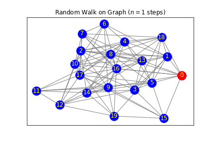
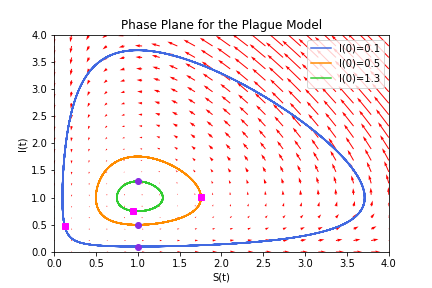
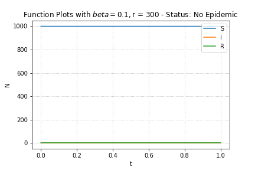

# Diffusion-Process-Projects
## File 1
Project 1: Simulating a random walk of an agent on a square lattice with 500 walks.

Project 2: Simulating Pearson’s random walk in the plane, where the steps have constant length a = 1 and uniformly distributed random angles.

Project 3: Simulating a random walk on a Random, Watts-Strogatz, and Barabasi-Albert graph.

## File 2
Project 1: Plague model

Project 2: SIR model

Project 3: SIR Model on a Graph Network (Random graph, Watts-Strogatz graph and Barabasi-Albert graph).

## File 3
Project: Q Voter Model
